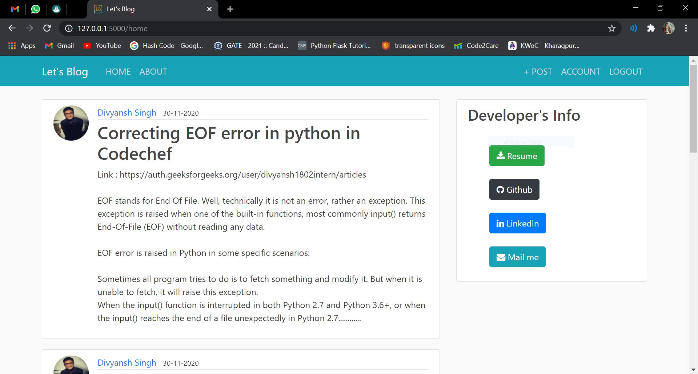
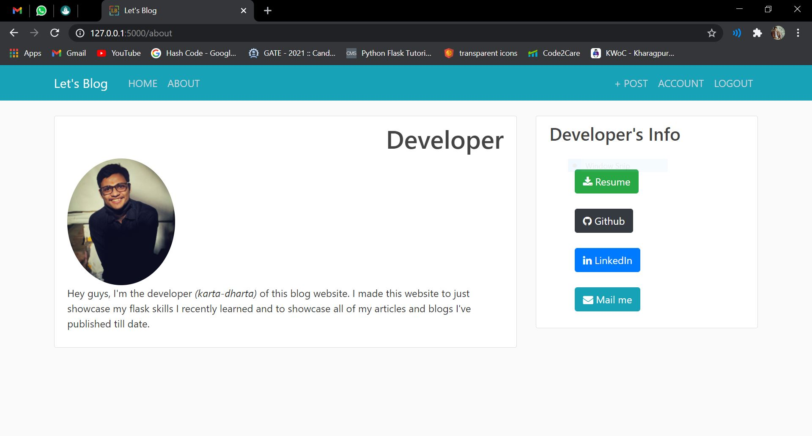
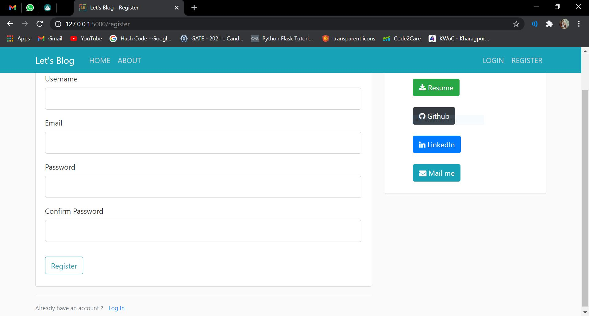
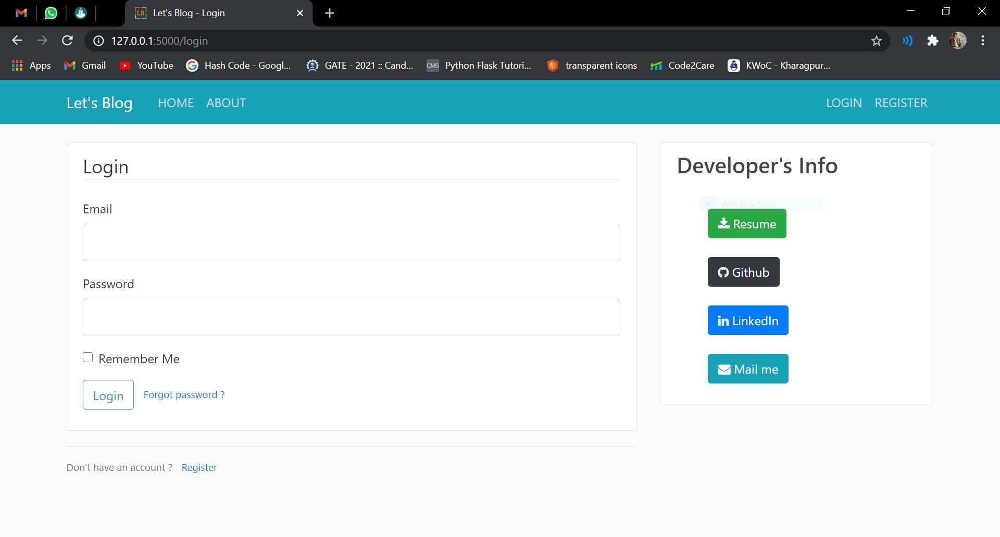
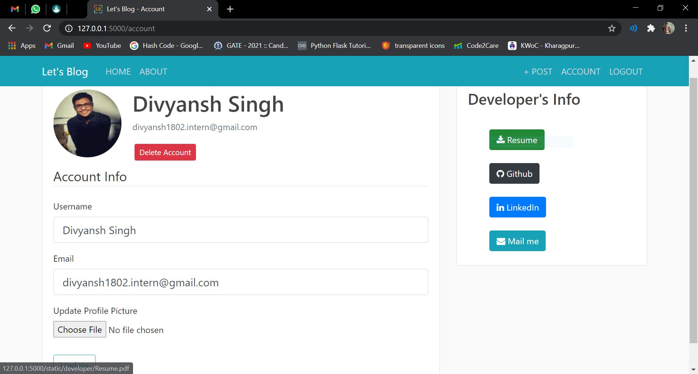
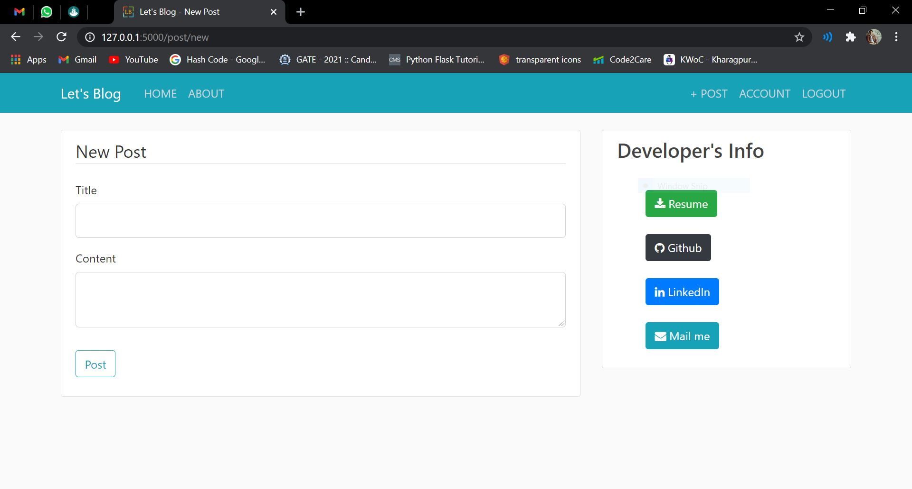

# Let's Blog

## About

Made this blog website so that I can write down all of my published blogs and articles on one place and allow other users to add their blog too.

## Setup

1. Clone the repo.
2. Create a virtual environment as shown below.
   - `python -m venv virtual-environment-name`
3. Activate the virtual environment as shown below.
   - `virtual-environment-name\Scripts\activate`
4. Install the dependencies and packages using requirements.txt file.
   - `pip install -r requirements.txt`
5. Run run.py file.
   - `python run.py`

## Knowledge Gained

1. Using foreign key for one to many relationship between post and user.
2. Creating Packages for better structuring.
3. Resizing Profile Pictures using `PIL` and renaming them using `os` modules.
4. Concept of Pagination.
5. Sending Mail using `flask_mail` and concept of `token`
6. Breaking application using `Blueprints` in case handling of Packages becomes tough.

## Features to be added

1. Improve Look (Home Page, About Page, Account Page).
2. Add `Add Links` field to Create Post Page.
3. Add My Posts feature in Account Page or Navbar.

## Snapshots

HOME PAGE :     
ABOUT PAGE :     
REGISTER PAGE :     
LOGIN PAGE :     
ACCOUNT PAGE :     
NEW POST PAGE :     
